# Database Schema (CRM Admin)

This document provides a detailed overview of the database schema for the CES Global platform. It is intended for use by developers building the CRM Admin dashboard. The schema utilizes PostgreSQL (via Supabase) and is designed to support course management, enrollments, payments, and automated email operations.

## Architecture Overview

Here is a high-level Entity-Relationship (ER) diagram illustrating the core relationships between tables:

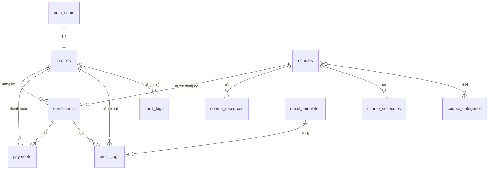

---

## Detailed Table Structures

### 1. `profiles`
Stores student information and serves as the central point for CRM activities. It has a 1:1 relationship with Supabase's built-in `auth.users` table and is automatically created upon Google login.

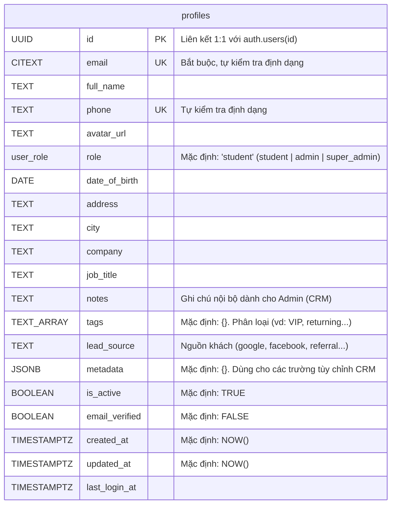

---

### 2. `course_categories`
Manages course categories (e.g., IELTS, TOEIC, Business English).

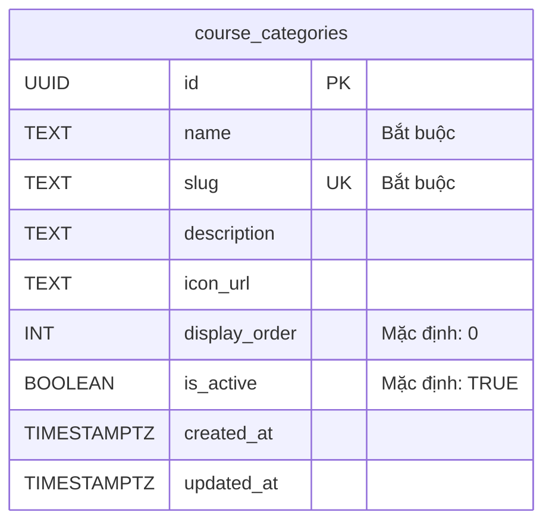

---

### 3. `courses`
Core table for course information. Includes fields for multi-session support, promotions, SEO, and capacity management.

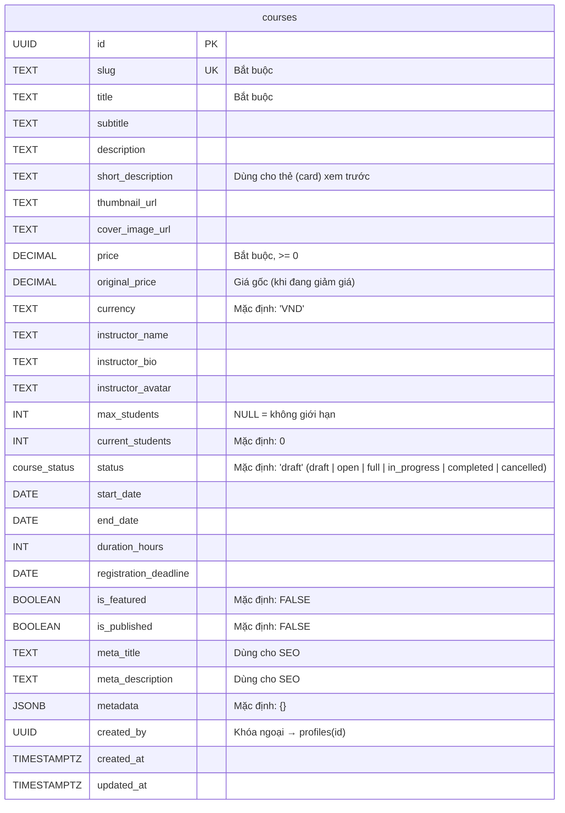

---

### 4. `course_category_map`
Junction table mapping the Many-to-Many (N:N) relationship between `courses` and `course_categories`.

```mermaid
erDiagram
    course_category_map {
        UUID course_id PK_FK "→ courses(id) CASCADE"
        UUID category_id PK_FK "→ course_categories(id) CASCADE"
    }
```

---

### 5. `course_resources`
Contains access materials such as Zalo group links, Facebook groups, class links, etc. **IMPORTANT: these are ONLY visible to students who have successfully paid.**

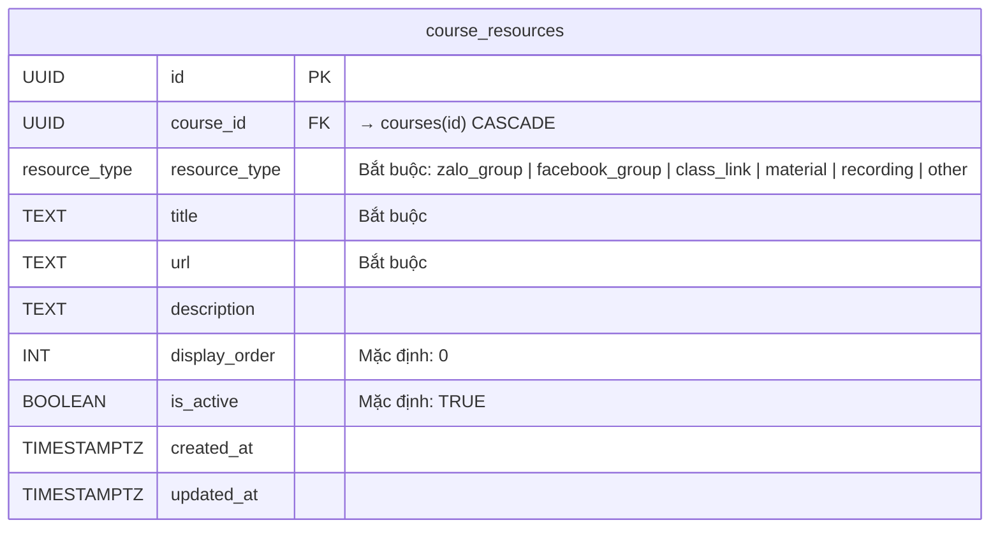

---

### 6. `course_schedules`
Maintains the detailed day-by-day or session-by-session schedule for each course.

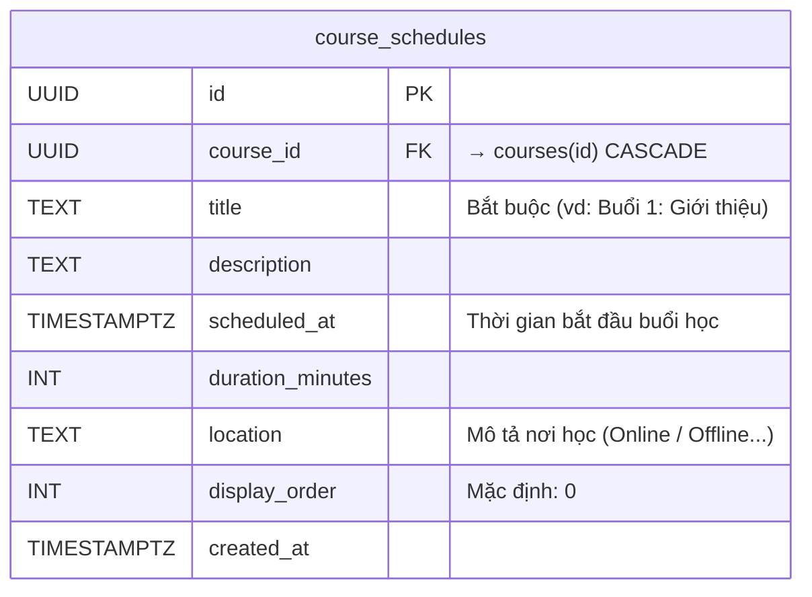

---

### 7. `enrollments`
Records a student's registration for a specific course. A constraint ensures a `UNIQUE(user_id, course_id)` pairing (a student can only register for a specific course once).

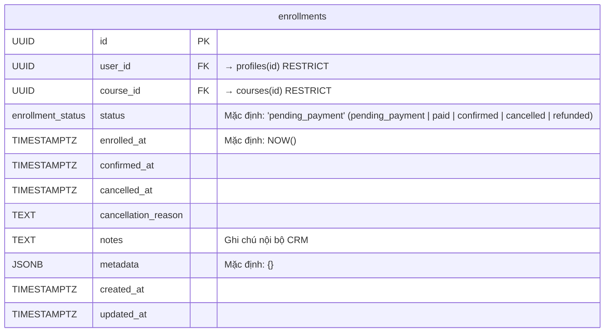

---

### 8. `payments`
Tracks multi-gateway payment transactions (e.g., Sepay, MoMo, VNPay, Stripe, Manual). 

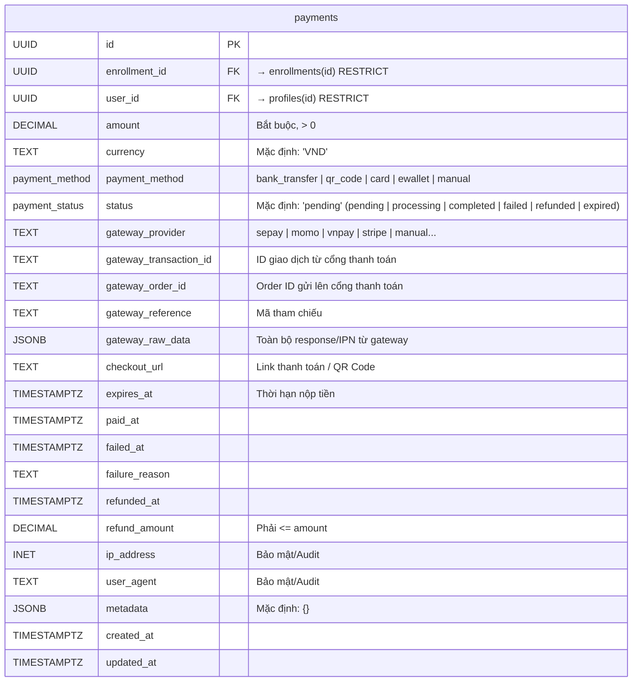

---

### 9. `email_templates`
Stores customizable email templates supporting `{{variables}}` substitution.

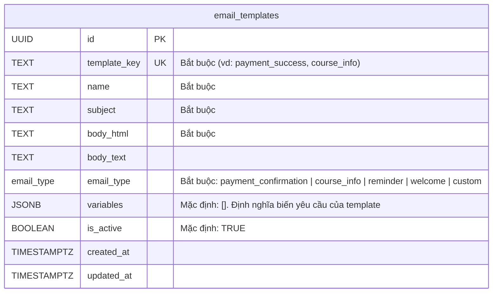

---

### 10. `email_logs`
Tracks sent emails, incorporating a retry mechanism for failed deliveries.

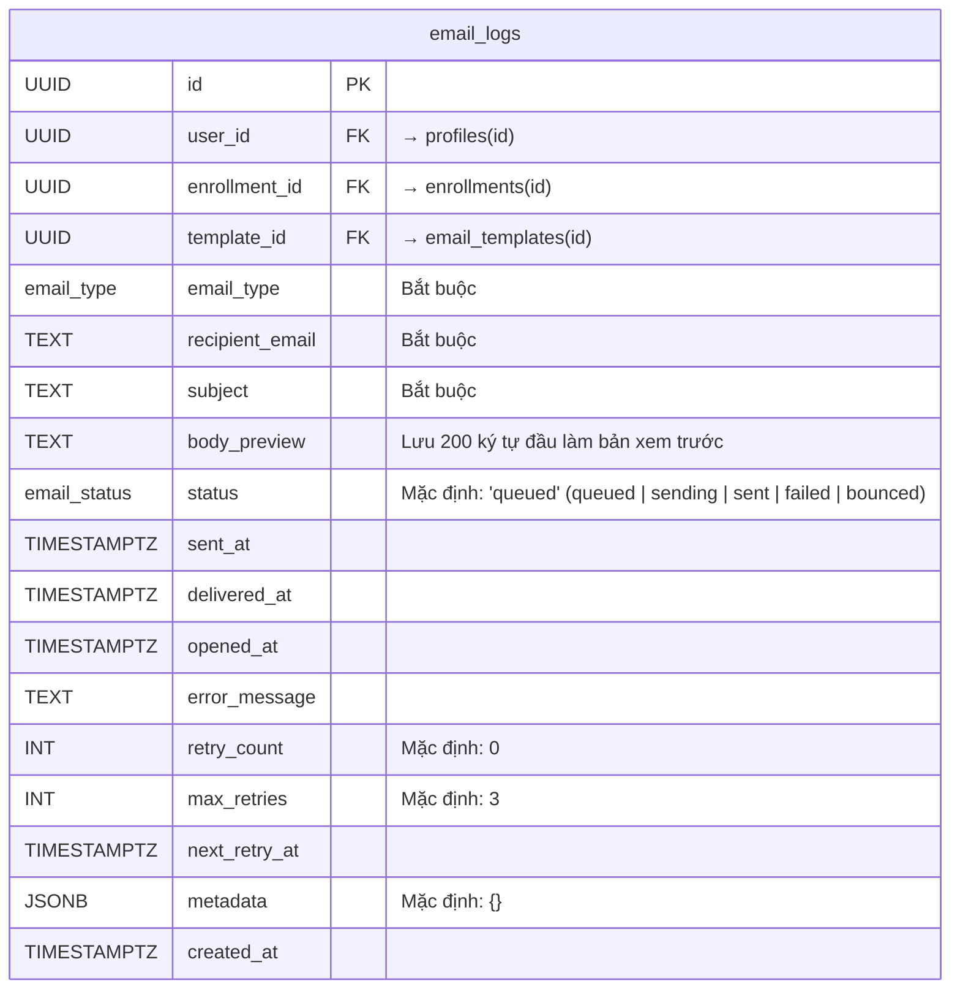

---

### 11. `audit_logs`
Audit trail of important user and standard CRM operations. Provides a history of changes for compliance.

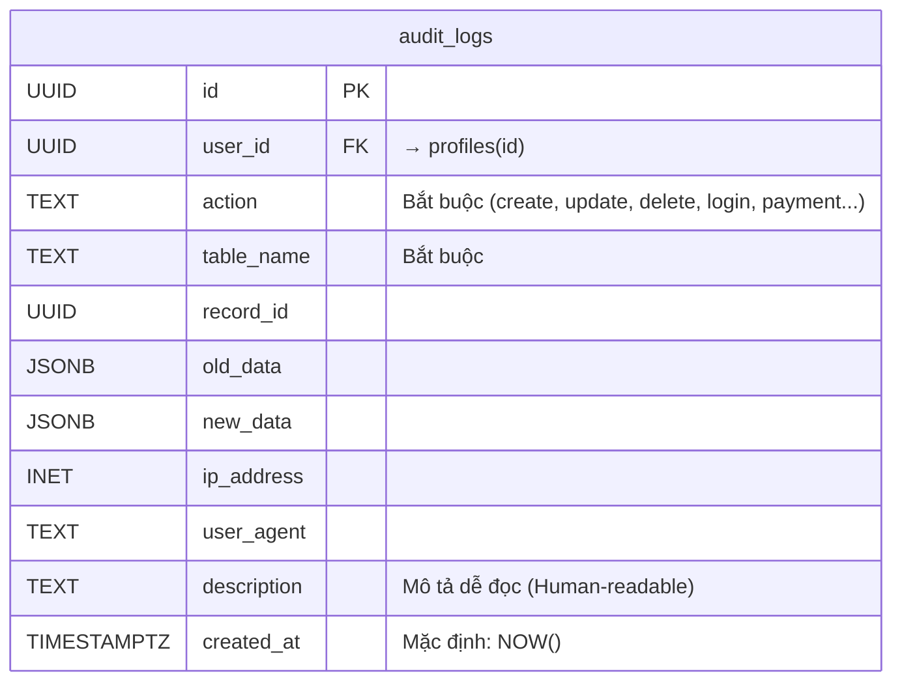

---

## Enumerable Types (ENUMs)

These custom PostgreSQL datatypes strictly define the allowed values for specific table states and rules.

| Enum Type             | Allowed Values                                                                                      |
| --------------------- | --------------------------------------------------------------------------------------------------- |
| `user_role`           | `student`, `admin`, `super_admin`                                                                   |
| `course_status`       | `draft`, `open`, `full`, `in_progress`, `completed`, `cancelled`                                    |
| `enrollment_status`   | `pending_payment`, `paid`, `confirmed`, `cancelled`, `refunded`                                     |
| `payment_status`      | `pending`, `processing`, `completed`, `failed`, `refunded`, `expired`                               |
| `payment_method`      | `bank_transfer`, `qr_code`, `card`, `ewallet`, `manual`                                             |
| `email_type`          | `payment_confirmation`, `course_info`, `reminder`, `welcome`, `custom`                              |
| `email_status`        | `queued`, `sending`, `sent`, `failed`, `bounced`                                                    |
| `resource_type`       | `zalo_group`, `facebook_group`, `class_link`, `material`, `recording`, `other`                      |

---

## Technical Notes for CRM Developers

1. **Triggers:** A PostgreSQL trigger automatically sets the `updated_at` column to `NOW()` upon row modification.
2. **Business Logic Location:** Be aware that all business logic (processing payments, triggering emails, tracking capacity) is governed by the Node.js/Express backend, **not** via complex database triggers. 
3. **Capacity Planning:** The `enrollments` table forces a UNIQUE constraint on the combination of `user_id` & `course_id`. A user can enroll in a course once. 
4. **CRM Functionality:** Utilize the `metadata`, `tags`, `notes`, and `audit_logs` fields/tables heavily when implementing administrative features in the CRM dashboard. 
