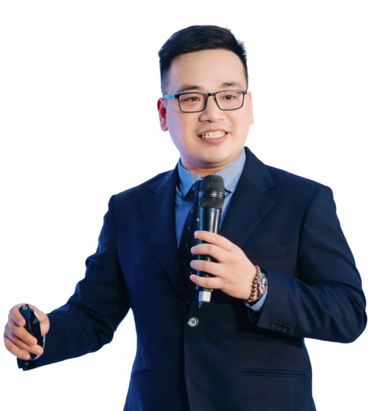
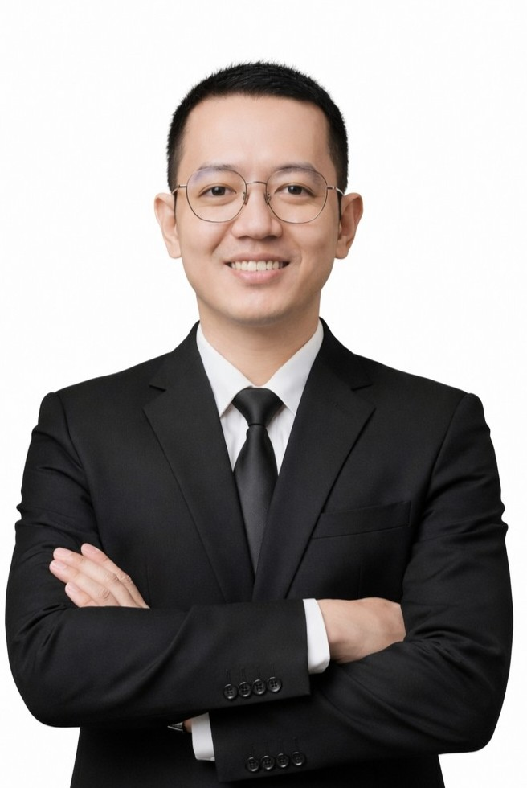

PHẦN V. GIỚI THIỆU GIẢNG VIÊN

1. Mr. Nguyễn Văn Tiệp

   Co-founder CES Global | Chuyên gia Chiến lược Chuyển đổi số & GenAI
   "Người kiến tạo tư duy chiến lược, đưa doanh nghiệp Việt tiếp cận chuẩn mực quản trị AI quốc tế."
   Tầm nhìn quốc tế: Tu nghiệp Lãnh đạo toàn cầu & Tái cấu trúc doanh nghiệp trong kỷ nguyên AI tại Đại học Harvard.
   Chuyên môn sâu: Thạc sĩ Khoa học máy tính (ĐH Colorado) và Chuyên gia đánh giá hệ thống quản lý AI theo tiêu chuẩn ISO/IEC 42001:2023.
   Kinh nghiệm thực tế: Tư vấn và đào tạo trực tiếp cho các "ông lớn" như Viettel, VNPT, Bảo Việt và các cơ quan Chính phủ (Văn phòng Quốc hội, Sở TT&TT TP.HCM).
2. Mr. Lưu Tuấn Anh

   Team Leader AI Automation | Chuyên gia Ứng dụng AI Sáng tạo & Tự động hóa
   "Biến ý tưởng thành sản phẩm thực tế thông qua sức mạnh của AI Agents và Automation."
   Thực chiến Kỹ thuật: 3+ năm nghiên cứu chuyên sâu về Generative AI & AI Art, trực tiếp xây dựng các hệ thống AI tự động hóa quy trình (Automation) cho doanh nghiệp.
   Tư duy sản phẩm: Đồng sáng lập Loverse & Cố vấn chuyên môn cho các dự án công nghệ (Heatmob, Modeli), mạnh về việc tích hợp AI vào quy trình sáng tạo và Marketing.
   Vai trò trong khóa học: Hướng dẫn học viên xây dựng Workflow, AI Agents và làm chủ các công cụ sáng tạo (Imagen, Veo) của Google.
   
4. Ms. Nguyễn Kim Anh

   Chuyên gia Đào tạo & Thiết kế trải nghiệm học tập AI
   "Cầu nối sư phạm giúp đơn giản hóa công nghệ phức tạp, biến AI thành công cụ dễ dùng cho mọi nhân sự."
   Bề dày đào tạo: Trực tiếp giảng dạy và ứng dụng AI cho hơn 5.000 học viên và giáo viên trên toàn quốc.
   Phương pháp sư phạm: Sở hữu chứng chỉ AI for Education (Advanced), chuyên sâu về cá nhân hóa lộ trình học tập, giúp học viên "Non-tech" tiếp cận AI dễ dàng.
   Ứng dụng thực tế: Có kinh nghiệm thực chiến trong mảng AI cho Báo chí, Truyền thông & Giáo dục, giúp tối ưu hóa quy trình nghiên cứu và sản xuất nội dung.
5.
