# CES Global - Database Schema

## Tổng quan

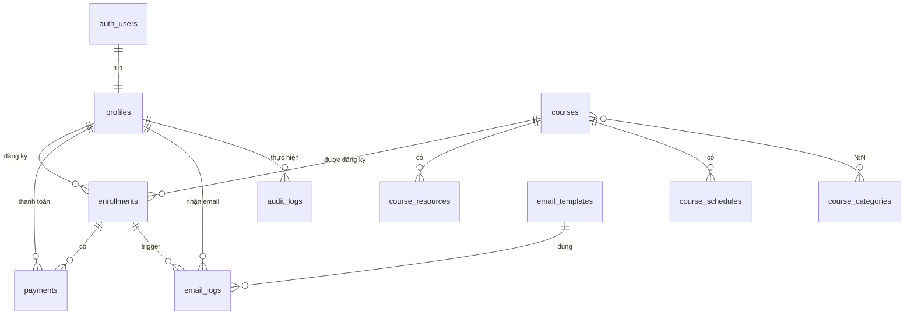

---

## Chi tiết từng table

### profiles
> Thông tin học viên — liên kết 1:1 với `auth.users`, tự tạo khi Google login

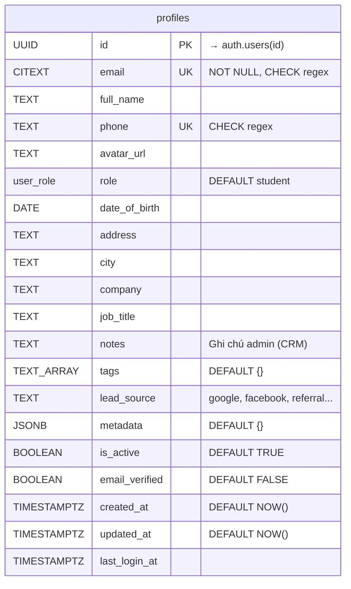

---

### course_categories
> Danh mục khóa học: IELTS, TOEIC, Business English...

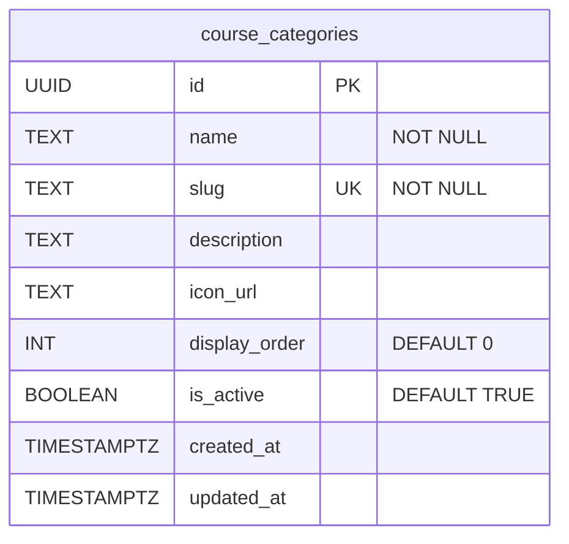

---

### courses
> Khóa học — support đa khóa, giảm giá, SEO, capacity

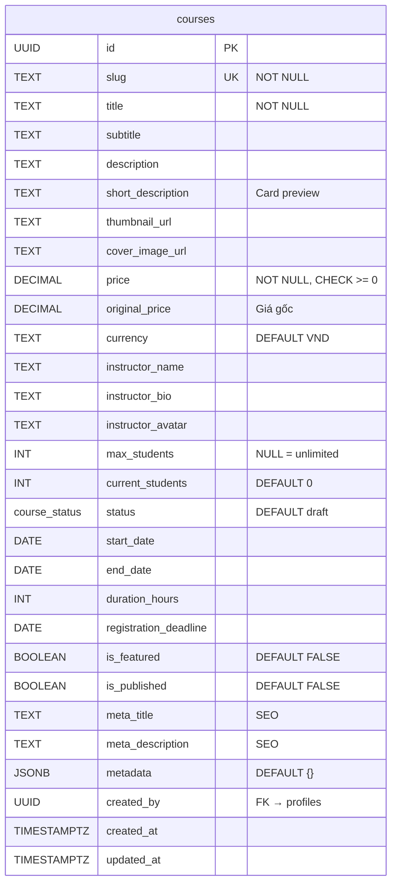

---

### course_category_map
> Junction table quan hệ N:N giữa courses và categories

```mermaid
erDiagram
    course_category_map {
        UUID course_id PK_FK "→ courses(id) CASCADE"
        UUID category_id PK_FK "→ course_categories(id) CASCADE"
    }
```

---

### course_resources
> Link Zalo, Facebook group, class link — CHỈ hiển thị cho học viên đã thanh toán

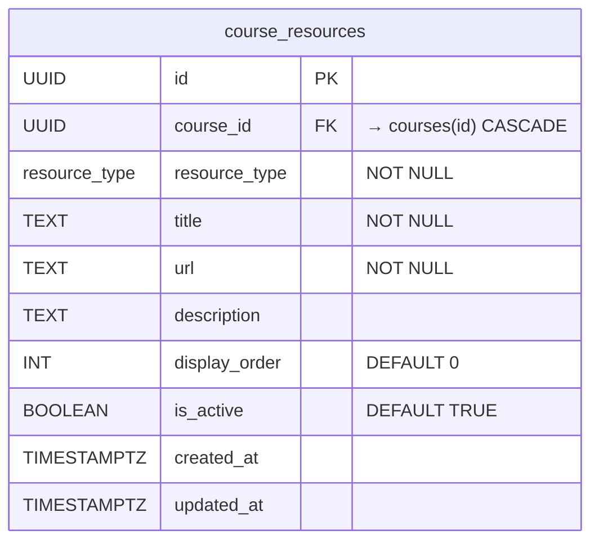

**resource_type values:** `zalo_group` | `facebook_group` | `class_link` | `material` | `recording` | `other`

---

### course_schedules
> Lịch học chi tiết từng buổi

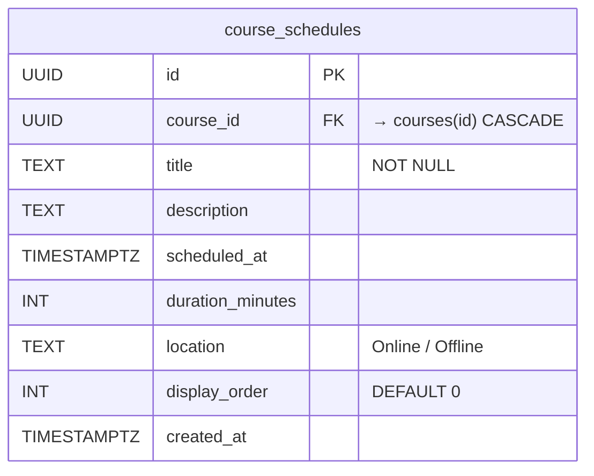

---

### enrollments
> Đăng ký khóa học — UNIQUE(user_id, course_id)

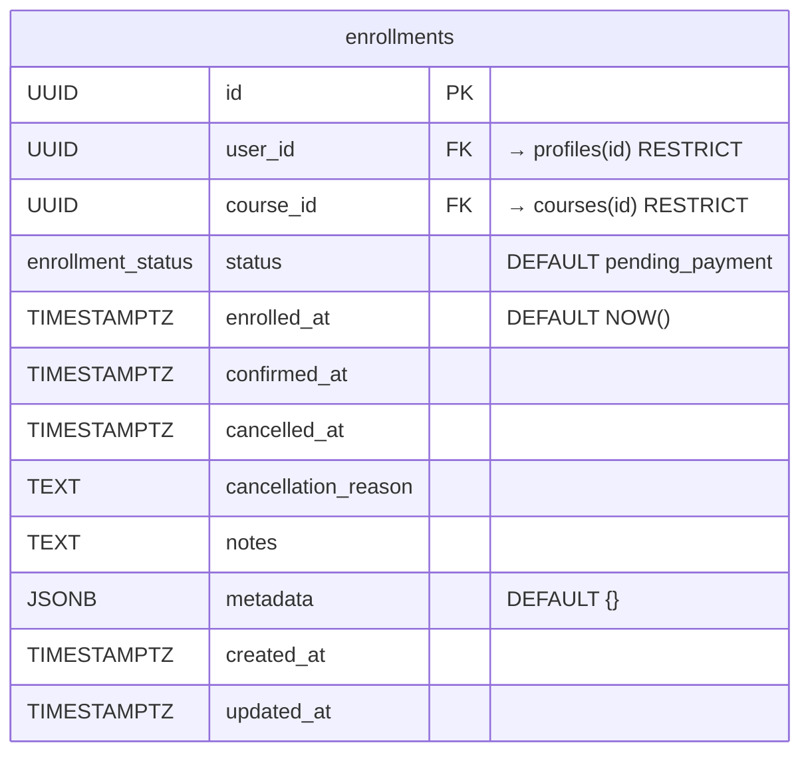

**enrollment_status values:** `pending_payment` → `paid` → `confirmed` | `cancelled` | `refunded`

---

### payments
> Giao dịch thanh toán đa cổng (Sepay, MoMo, VNPay, Stripe, manual...)

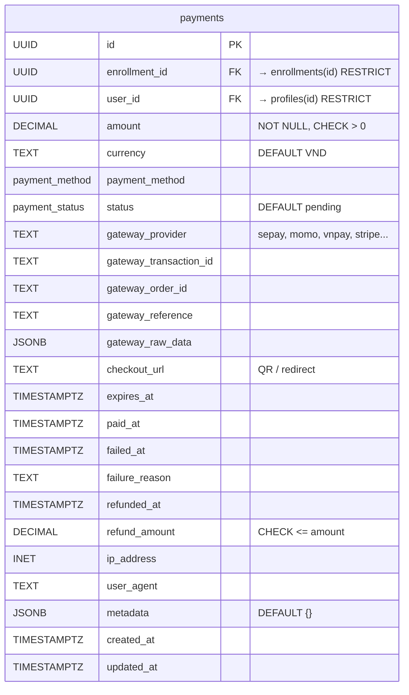

**payment_method values:** `bank_transfer` | `qr_code` | `card` | `ewallet` | `manual`  
**payment_status values:** `pending` → `processing` → `completed` | `failed` | `refunded` | `expired`

---

### email_templates
> Template email tùy chỉnh, hỗ trợ `{{variables}}`

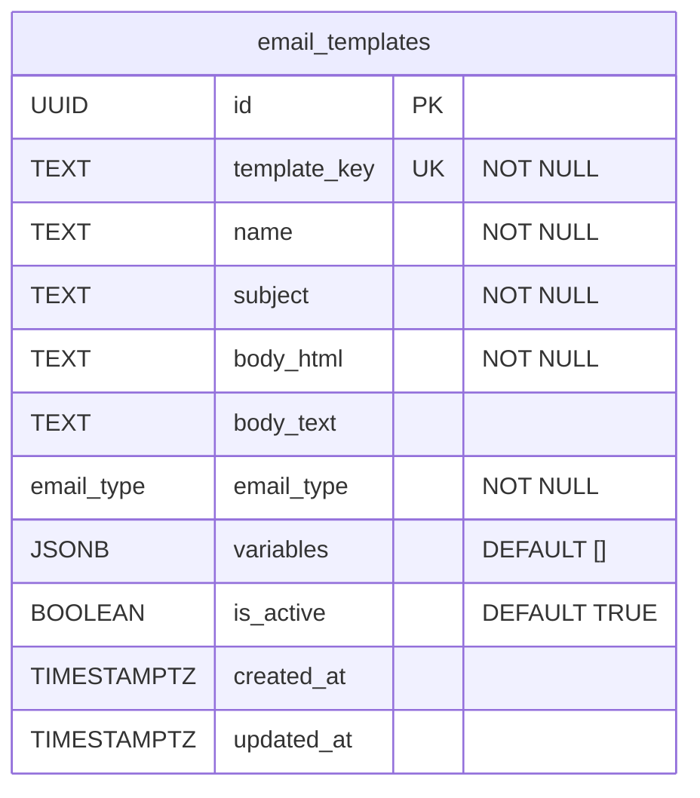

**Seed templates:** `payment_success`, `course_info`, `welcome`

---

### email_logs
> Log gửi email với retry mechanism

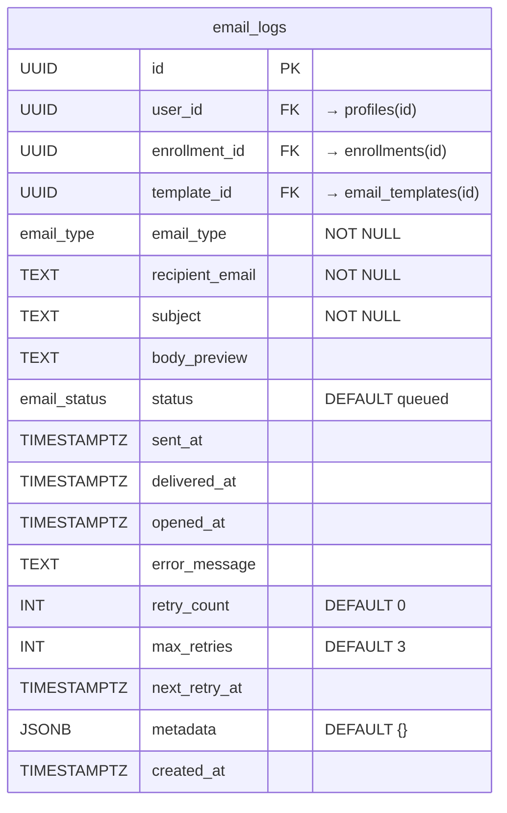

---

### audit_logs
> Audit trail cho mọi thao tác quan trọng

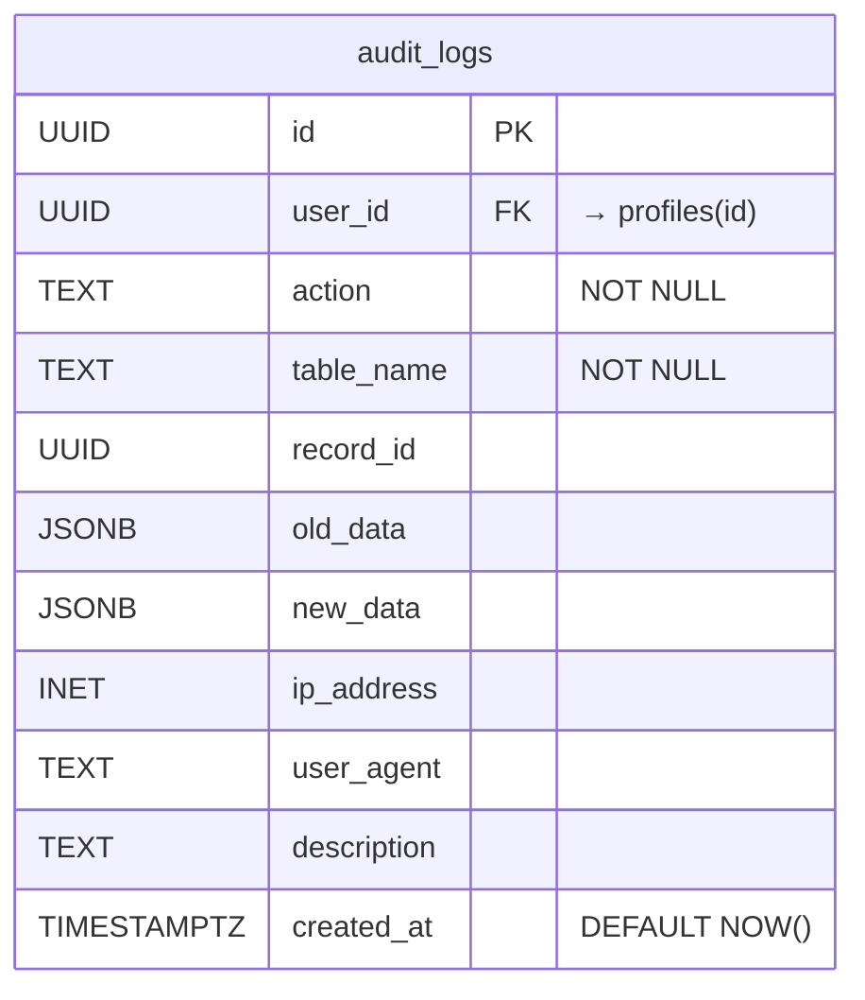

---

## ENUMs

| Type | Values |
|------|--------|
| `user_role` | `student`, `admin`, `super_admin` |
| `course_status` | `draft`, `open`, `full`, `in_progress`, `completed`, `cancelled` |
| `enrollment_status` | `pending_payment`, `paid`, `confirmed`, `cancelled`, `refunded` |
| `payment_status` | `pending`, `processing`, `completed`, `failed`, `refunded`, `expired` |
| `payment_method` | `bank_transfer`, `qr_code`, `card`, `ewallet`, `manual` |
| `email_type` | `payment_confirmation`, `course_info`, `reminder`, `welcome`, `custom` |
| `email_status` | `queued`, `sending`, `sent`, `failed`, `bounced` |
| `resource_type` | `zalo_group`, `facebook_group`, `class_link`, `material`, `recording`, `other` |

---

## Indexes

| Table | Index | Type |
|-------|-------|------|
| profiles | email, role, is_active, created_at, tags | B-tree, GIN, Partial |
| courses | slug, status, is_published, is_featured, start_date | B-tree, Partial |
| course_resources | course_id, resource_type | B-tree |
| course_schedules | course_id, scheduled_at | B-tree |
| enrollments | user_id, course_id, status, (user_id+course_id) | B-tree, Composite, Partial |
| payments | enrollment_id, user_id, status, gateway_provider, gateway_tx_id, gateway_order_id | B-tree, Partial |
| email_logs | user_id, enrollment_id, status, (retry) | B-tree, Partial |
| audit_logs | user_id, table_name, action, (table+record) | B-tree, Composite |
